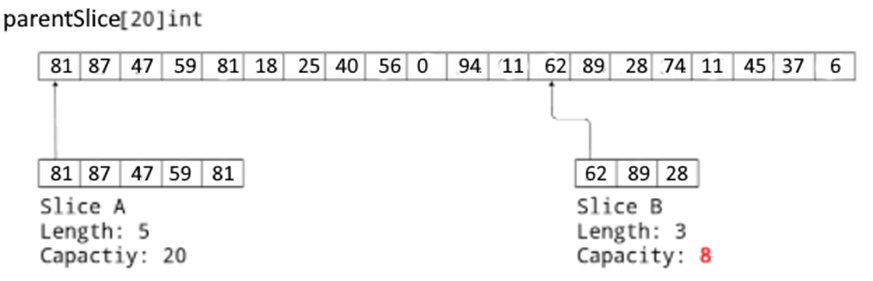
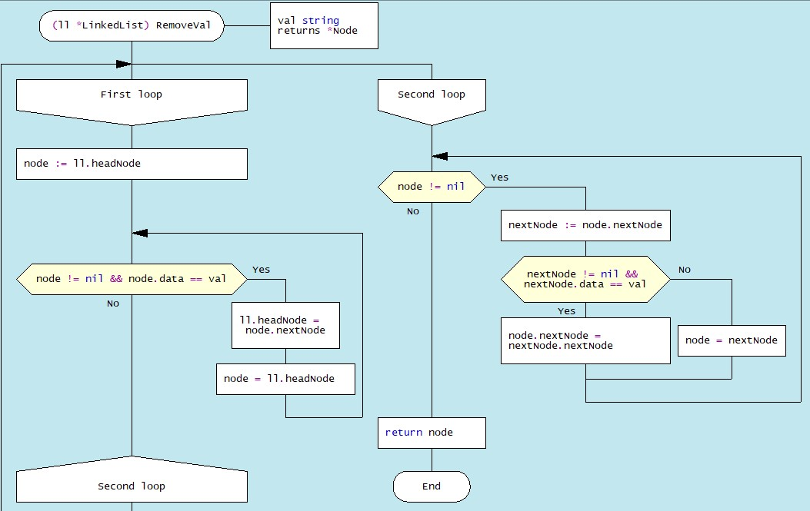

# SECTION 4. IMPLEMENTATION OF BASIC ABSTRACT DATA TYPES IN GOLANG

## 4.1. Data Structuring Features
Recall - the abstract data type is a mathematical data model and various operators defined within this model.
Data processing algorithms can be developed in terms of ATD, but to
implement them in a particular programming language, it is necessary to find a way to represent ATD in terms of the data types and operators (methods) supported by this programming language.

In practical terms, the data structure is a collection of data
structured in such a way as to ensure their efficient use by users. This requires a certain ordering of data, primarily at the level of storage in computer memory. Reducing space and increasing its organization in conjunction with reducing the time complexity of different tasks is the main objective of working with data structures.

Considerable experience in the development of computer technology and computing technology has made it possible to classify data structures into different categories. First, simple and integrated structures are distinguished by complexity. The criterion of simplicity is the indivisibility of this, that is, in a computer implementation - a simple chain of bits. Simple, basic structures include variables of different types: integers, real numbers, logical, string.

Integrated (composite, complex) are data structures whose component
parts are other data structures, including simple and integrated. Many basic integrated data structures are predefined by a specific
programming language: arrays, slices, structures, etc. Such structures can be created by users for a specific problem, using basic integrated structures.

By way of presentation, the data structures are divided into logical and physical. The logical structure is an abstract data layout that the user or programmer envisions. Physical structure is a method (schema) of specific data placement in the memory of a computer. In general, the logical and physical structures of the same data do not coincide. In a logical (abstract) structure, data tend to be adjacent to each other, while in a computer implementation these data may be located in different memory regions.

An important feature of the data structure is the existence of links
between the elements of the structure. On this basis, disconnected and connected are distinguished. Disconnected structures are characterized by a lack of linkages between the elements of the structure, while connected structures are characterized by linkages. Disjoint structures include arrays, strings, stacks, queues, and connected lists. 
In many cases, data can be characterized by variability, i.e., a change in the number of elements and (or) the relationships between elements of the structure. *Arrays, sets, records, tables* are under the category of *static data*, *stacks, queues, trees* - under the category of semi *static data*,*linked lists and graphs* - under the category of *dynamic data*.

Linear and non-linear data structures are distinguished in structure
order. Linear structures are divided into structures with sequential
distribution of elements in memory (*vectors, strings, arrays, stacks, queues*) and structures with arbitrary connected distribution of elements in memory, depending on the nature of the reciprocal arrangement of elements in memory (simply connected and doubly connected linear lists). Nonlinear structures are *multi-linked lists, trees, graphs*.

One of the defining features of data structures is how to access data. In the access method, a search mechanism is important - an algorithm that determines the access path that is possible within a given memory structure, and the number of steps along that path to find the data sought. There are two main groups of data access methods: sequential and direct
\[[https://www.geeksforgeeks.org/memory-access-methods/]{.mark}\].

*Sequential access* means that a group of elements is accessed in a
predefined ordered sequence. An example of sequential access is *single linked list*. The various elements of the data structure are directly accessed by providing a unique address for these elements.

Finally, one characteristic of data structures is homogeneity.
Homogeneous are structures that contain a set of simple data of the same
type (numeric, logical, string, etc.). Heterogeneous structures combine
data of different types. Examples of homogeneous structures are arrays,
slices, stacks. These structures include records and sets.

The presence of a large number of features of data structures
predetermined various attempts to classify them. From a programming
point of view, the main features are: linearity/non-linearity, data
access, homogeneity/heterogeneity of data. This section covers the
Go-implementation of linear abstract data such as array/slice, map,
linked lists, stacks, and queues.

## 4.2. Linear data structures

Linear data structures are structures in which data elements are
arranged in sequence. Linear structures can be distinguished by the way
the individual elements of a data collection are accessed and by the
homogeneity of the data (homogeneous and heterogeneous).

### 4.2.1 Linear direct access structures

The basic linear direct access structures are homogeneous (*arrays* and *slices*) and heterogeneous (*linked lists, stacks, queues*). 

a) Array 

An array is a collection of data, belonging to the same type. For
example, the collection of integers 24, 12, 36, 6, 47, 11 forms an array (Figure. 4.1.).


<figcaption>Figure 4.1. One-dimensional array</figcaption>

It is not allowed to mix values of different types, such as an array
containing both characters and integers. There are different ways to
declare arrays: 
*var array_name\[\]Type*

or

*var array_name\[length\]Typle{item1, item2, item3, \...itemN}*

In addition, in the language Go arrays can be declared in the
shortened form: *array_name:= \[length\]Type{item1, item2,
item3,\...itemN}*

In Go, you can create a multidimensional array using the following
syntax: *array_name\[Length1\]\[Length2\]..\[LengthN\]Type*

However, array data is rarely used in Go. Much more convenient is a
collection of data like a *slice*.

 b\) Slice

A slice is a variable-length data collection that stores elements of a homogeneous type. A slice can be thought of as a slice of an array. Slice syntax (T - type) of data:
\[\]T or \[\]T{} or \[\]T{value1, value2, value3, \...valuen}

A slice has three components: *pointer, length*, and *capacity*. To create a slice in this form, use the *make* function. For example, in Figure 4.2. creating a parentSlice looks like this: *parentSlice = make([]int, 20, 20*)


 <figcaption>Figure 4.2. Create different slices of *SliceA* and *SliceB*</figcaption>

*The pointer* indicates to the first item of the array accessible
through the slice (which is not necessarily the same as the first item
of the array). Length is the number of slice elements; it cannot exceed
the capacity, which is typically the number of items between the start
of the slice and the end of the underlying array. These values are
returned by the built-in functions *len* and *cap*. Multiple slices can
be created from a single array with different pointer, length, and
capacity values. In Figure 4.2. the primary slice/array *parentSlice* is
shown, on the basis of which two slices of different lengths are
created, starting from different places. To do this, use the notation
*sliceA := parentSlice\[:5\]* and s*liceB := parentSlice\[12:15\]*.
Here, the capacity of *SliceA* is 20 and *sliceB* is 8 because Go
defines this value as the difference between the length of the primary
array (20) and the index of the first item of *Slice B* (12).

The following functions are used for work with slices: 1. The built-in
*append()* function is used to add elements to the slice. If the basic
slice size is insufficient, a new slice is automatically created and the
old slice is copied. 2. The *len()* function returns the number of
elements present in the slice. 3. The *cap()* function returns the
capacity of the base slice. 4. *Copy(),* the content of the original
slice, is copied to a slice of the destination.

c\) Structure

Golang supports data collections as structures consisting of a set of
multiple data types (fields) represented as a single entity. In Golang
the structure is implemented with the help of data type Struct:
```Go
package main
import (
    "fmt"
)

type Employee struct {
firstName string
lastName string
age int
salary int
}

func main() {
// creating a structure with specifying field
emp1 := Employee{
firstName: "Peter", age: 35, salary: 20000, lastName: \"Wolf\",
}
// creating a structure without specifying field names
emp2 := Employee{\"Nick\", \"Smith\", 49, 35000, }
fmt.Println(\"Employee 1\", emp1)
fmt.Println(\"Employee 2\", emp2)
}

Output.
Employee 1 {Peter Wolf 35 20000}
Employee 2 {Nick Smith49 35000}
```
*Note*. When you type the order of the fields on the monitor *(emp1)*, it is not necessary to match the order when you create the structure. In the second case of creating a *structure (emp2)* the order must coincide.

Golang allows to create pointers to a structure.
```Go
package main
import (
    "fmt"
)

type Employee struct {
firstName string
lastName string
age int
salary int
}

func main() {
emp3 := &Employee{
firstName: \"Sam\",
lastName: \"Shaffer\",
age: 55,
salary: 22000,
}

fmt.Println(\"First Name:\", (\*emp3).firstName)
fmt.Println(\"Age:\", (\*emp3).age)
}

 Output.
First Name: Sam
Age: 55
```
d). Map

Maps are collections that use unordered key-value pairs, where keys are
unique identifiers associated with each value in the map. Maps are
especially effective in data retrieval algorithms. Map keys can be of
almost any type, unlike arrays and slices, which use sequences of
numbers for keys. The type for keys and calculations in Go needs to be
refined. To declare a map with keys of type string and values of type
int, the following syntax is used:


A map can be created using the make:
```Go
employeeAge := make(map[string]int)
employeeAge["P. Brown"] = 45
```


We will demonstrate various operations related to working with maps using a specific example. Our objective is to create a map containing data about employees and their ages (*employeeAge*).
```Go        
employeeAge := map[string]int{}
```


We will demonstrate various operations related to working with maps using a specific example. Our objective is to create a map containing data about employees and their ages (*employeeAge*).

Initialization of this map:
```Go
employeeAge = map[string]int{
  "P. Wolf": 45,
  "В. Smith": 47,
}
```
Addition of a new entry:
```Go
employeeAge["К. Tompson"] = 34
```
Output to the monitor:
```Go
map[S. Bondes:34 D. Levis:47 G. Ivens:45]
```
The map can be created using the function *make*:
```Go
employeeAge := make(map[string]int)
employeeAge["P. Peters"] = 45
```
Other operations with the card.
Key update:

To get the value corresponding to the key:

age := employeeAge\[\"К. Маркин\"\]

Delete a key-value pair:

delete(employeeSalary, \"Tom\")

To verify that the key exists:

val, ok := mapName\[key\]

If the key exists, the *variable val* will be the value of the key in
*the map*, and the variable *ok* will be *true.* If the key does not
exist, the *val* variable will receive a zero default value of type
*value*, and the *ok* variable will be *false.*

## 4.3. Linear sequential access structures

Sequential access to data means that only one element of the structure
can be accessed at any given time, and the elements are accessed in a
certain order. Classical examples of a sequential access structure are a
singly linked list, a stack, and a queue.*.*

**а) Linked List**

A linked list is a dynamic data structure, the elements of which are
called nodes, consisting of two parts: content and reference. The
content part for storing a data value can be one of the basic data
types, such as an integer, a floating point number, a string, or some other data type. The reference part is a link that is used to store the address of the next element in the list.

Linked lists find their way into many computing tasks, from organizing operating systems to creating playlists. In particular, they are useful when processing the file system: sometimes it is difficult to find disk space to hold the entire file, so it can break into scattered fragments.
To organize work with these fragments, a linked list of sections is
formed in which file fragments are stored on disk. In this they differ from arrays or slices, where all elements are located adjacent to each other.

There are different types of linked lists. First of all, they differ in the number of fields (simply connected and biconnected lists) and in the way the elements are connected (linear and cyclic). In the simplest case of a simply connected list, each node (except for the last node) contains a link (pointer) to the next node of the same list. The reference part contains the address of the next node. The reference part of the last node contains the value nil (Figure 4.3).


<figcaption>Figure 4.3. Simply linked list structure</figcaption>

The structure of an individual linked list node can be described by the struct data type as follows: 

```Go
type *Node* struct {
data string
nextNode *Node
}
```
The linked list structure contains the _list length_, _head node_ and _tail node_:

```Go
type LinkedList struct {
len      int
headNode *Node
}
```

The "len" field in the linked list structure contains its length. The "headNode" field stores the memory address of the header (the first node in the linked list). Initialization (instance creation) of a structure of type LinkedList is performed as follows:

*var ll LinkedList = LinkedList{}*

The Golang language provides the ability to implement various operations with linked lists, among which the main ones are:

-   • inserting an element into the list;

-   • removal of an element from the list;

-   • search for an element in the list;

Consider the operation of inserting an item into a linke dlist (Figure 4.4):


<figcaption>Figure 4.4. Inserting a new node at the beginning (a) and at the end (b) of the linked list</figcaption>

Three methods are used to insert new nodes: at the beginning of the
list - *PushFront(val)*, at the end of the list - *PushBack(val)* and at
the specified position *PushVal(nodeVal,val)*, where the val parameter
is the value of the list element of one type or another (in the given
string), *nodeVal* - the value of the list element after which the new
node is inserted. Let us consider sequentially the algorithms of all
three methods. Removing nodes implements the *RemoveVal(val)* method

a)  Method *PushFront* -- inserting a new node at the beginning of the
    list

This method implements the process of inserting a new node at the top of
the linked list. The algorithm of the method is presented in the form of
DRAKON- diagram with the subsequent automatic generation of program code in the DRAKON WEB Editor (Figure 4.5).


<figcaption>Figure 4.5. DRAKON-diagram of rhe method *PushFront(val)*</figcaption>

b)  The method *PushBack* -- inserting a new node at the end of the list

Inserting a new node at the end of a singly linked list is implemented
using the *PushBack(val)* method. The algorithm for inserting a new node
at the end of the list consists of the following steps. A new node
*(newNode)* is created, to which a parameter *(val)* is passed. If the
list is empty, then the new node will be both the first and the last
node in the list. If the list is not empty, then all nodes are traversed
to the end of the list and a new node is added to the end of the list. DRAKON-diagram of the method *PushBack(val)* is shown on Figure 4.6.


<figcaption>Figure 4.6. DRAKON-diagram of node insertion algorithm to the linked list end</figcaption>

c)  The method *PushVal(nodedata,val)* - insertion after specified node

The third method *PushVal(nodeVal,val)* implements the process of
inserting a new node with the *val* parameter after the node with the
*nodeVal* value. The method algorithm first refers to the
*NodeWithNode(nodeVal)* module, which defines the node after which the
new node should be inserted. In our case, the word \"probably\" is
inserted into the list created above after the node with the content
\"This\". The dragon diagram of such an insertion algorithm and the
corresponding program code are shown in Figure 4.7.


<figcaption>Figure 4.7. DRAKON-diagrams of node insertion algorithms NodeWithVal
PushVal</figcaption>

The basic methods of working with linked list nodes include methods for
deleting one or more nodes or deleting nodes by condition. Consider the
algorithm for deleting a node by a specifided value.

**RemoveKey method (val) – remove the specified node**

Removing a node from a linked list after the specified value (*k*) is performed using  the *RemoveVal(val)* method, the parameter of which is the   key *val*(the data field of the Node list node structure). To delete a list node with  the  key "val*, you must first locate the node. In this module,  the first node  (*ll.head.data == key* is checked first) and if the key matches the value of the *ll.head.data* field, then the address of the first node is replaced with the address of the next node, which becomes the main node (*ll.head.next*). Further in the loop, the node with the desired key is searched for and the nodes are shifted (Fig. 4.8).


<figcaption>Figure 4.8. Illustration of removing a node from a list</figcaption>

A Drakon-diagram of the algorithm for removing a node by value is shown in Figure 4.9.



<figcaption>Figure 4.9. Drakon-diagram of removing a node from the RemoveVal list</figcaption>

As an example, let's create a list consisting of five nodes containing five values: *"Smith A.", "Shafler B.”,"Wiley D.", "Brown G.", "Black H."*.  To form a list,  you need to create the *Node{data, nextNode)* type, where *data* is the value, and *nextNode* is the address of the next node and the *LinkedList(len, headNode)* type, where *len* is the length of the list, and   *headNode*  - list header with type **Node*.

Next, in  the *main()* function, you need to initialize and create an instance  of the *linked List* and insert the first node (*header*) by calling the *PushFront("Smith A.")* method. Next, new nodes are inserted at the end of the list using the *PushBack()* method: 

func main() {
    var ll LinkedList = LinkedList{}
    ll.n = 0
    ll.PushFront("Smith A.")
    ll.PushBack("Shafler B.")
    ll.PushBack("Wiley D.")
    ll.PushBack("Brown G.")
    ll.PushBack("Black H.")

Next, after the node with the value of *Brown G.* insert a node with the value *Singer L.* and delete the node with the *Black H.* value:

ll.PushVal("Brown G.", "Singer L.")
ll.IterateList()
ll.RemoveVal("Black H.") 
ll.IterateList()
}

The results of processing list nodes are displayed on the monitor using the IterateList() method  (Figure 4.10.):


 <figcaption>Figure 4.10. Dragon diagram of the *IterateList()* method</figcaption>

In the presented program code, the elements of the list are data of the string type. In order for the program to work with lists whose elements are numbers (integer or real), it is necessary to  use the interface{}  signature instead of the  built-in string type

Result:
Linked list length = 5
Completed list
20 -> 30 -> 40 -> 50 -> 70 ->
Linked list length = 4
Linked list after deleting a node with a value of 40: 
20 -> 30 -> 50 -> 70 ->
}

> **b). Stack**

A stack is an abstract data type that contains elements with two basic operations:*Push*, which adds an item to the collection, and *Pop*, which deletes the last item added. A media set of this type includes a set of all stacks that contain elements of type *T*, including an empty stack, a stack with one element of type *T*, a stack with two elements of type *T*, and so on. From a technological point of view, a stack is a memory, in which the values of the data are loaded and retrieved according to the *"last in - first out" (LIFO - Last-In-First-Out)* strategy. Data enters the stack  from only one side, called  the top of the stack (Figure 4.11.).


 <figcaption>Figure 4.11. Last-in, first-out stack work</figcaption>

A common illustration  of a stack is a stack of plates: only one plate is available at any given time - the one that is placed on the pile last, i.e., the top. In order to access an arbitrary plate inside the stack, you must first sequentially remove all the plates above it. The most common use of this structure is the implementation of the *"Undo Last Action"* operation in various editors (*Ctrl+Z*). There are other examples of data organization in a stack, such as using recursive function calls. Each function call address is stored on the stack and retrieved in reverse order. 
Before performing any operations on the stack, let's look at how to programmatically create stacks in the Golang programming language. To create a stack, you can use a new type of Stack in the form of a slice:
```Go
type Stack struct {
    data []interface{} 
}
```
In this description interface{} it's a special type in Golang that can represent values of any type. Thus, a slice data can contain elements of different types (for example, numbers or strings). 
According to the purpose of the stack, the main operations with its elements are the function  (method) of adding *Push(item)* and the function (method) of removing *Pop()*:

Let's take a look at the s.data = s.data[:len(s.data)-1]. This is the key line that removes the element from the stack. It works by modifying  the *s.data* slice to  exclude the last element. In Golang, slicers are dynamic, and you can resize them using  the *s.data[:n]* syntax, which returns the first  *n* elements of the slice. Here, *n* is equal  to *len(s.data)-1* , which means "all items except the last one". In this way, the last item is removed from the stack.
Suppose the members of a single stack instance are integer data: *10, 20, 30. 40*, and the other instance string data *"First", "Second", "Third", "Fourth"*. Then, in  the *main()*  function, there are two instances of the stack of type Stack are created:
```go
    stack := Stack{}
```
Three elements are added to the initially empty stack using the Push(item)  function:
```go
   stack.Push("First")
   stack.Push("Second)
   sack.Push("Third")
```
Then remove one item at the top of the stack:
```go
stack.Pop()
```
As a result of the specified operation, the output is displayed:
    Stack --> [First Second Third]
    Stack after removing -->  [First Second]

According to the second approach, the new type is declared as a linked list in the form of a structure with two elements: the address of the head node (head):

```go
type Stack struct {
	head *Node
}
```

In turn, the head struct member  is of type *Node,
```Go
type Node struct {
	data interface{}
	next *Node
}
```

This means that, according to the concept of the Golang programming language,  the Stack  structure inherits the properties  of the Node structure.Then the *Push(val)* function  looks like this:

```Go
func (s *Stack) Push(val interface{}) {
	newNode := &Node{data: val, next: s.head}
	s.head = newNode
}
```
and the function to remove an element from  the *Pop()* stack is:

```Go
func (s *Stack) Pop() interface{} {
	if s.head == nil {
		return nil
	}
	data := s.head.data
	s.head = s.head.next
	return data
}
```
For this option, the main() function looks like:
```Go
func main() {
	stack1 := &Stack{}
	stack2 := &Stack{}
	stack1.Push(10)
	stack1.Push(20)
	stack1.Push(30)
	stack2.Push("First")
	stack2.Push("Second")
	stack2.Push("Third")
	fmt.Println("The top element integer value of the stack", stack1.Peek())
	fmt.Println("Contents of an integer stack")
	fmt.Println(stack1.Pop())
	fmt.Println(stack1.Pop())
	fmt.Println(stack1.Pop())
	fmt.Println(stack1.Pop())
	fmt.Println("The top element string value of the stack", stack2.Peek())
	fmt.Println("Contents of an string stack")
	fmt.Println(stack2.Pop())
	fmt.Println(stack2.Pop())
	fmt.Println(stack2.Pop())
	fmt.Println(stack2.Pop())
```

> **с). Queue**

*Queue* — it is a linear data structure that differs from the stack in the order in which the elements are deleted: the last added element is deleted in the stack; in the queue, on the contrary, the element added first is deleted (Figure 4.12).


 <figcaption>Figure 4.12. Работа структуры «очередь</figcaption>

The data structure in the form of a queue finds its application in multitasking systems, in communication systems (networks with intermediate storage), in queuing networks. Queues play an important role in computing when resources are provided on a first-come, first-served basis, such as jobs sent to a printer or processes waiting for a processor in the operating system. 
The Queue abstract  data type  is defined as a class whose objects implement the FIFO or First-In-First-Out principle for the items that are added and removed. From the point of view of the concept of ATD, a queue is a container that contains values of a certain type. The media set of this data structure is the set of all queues that contain items of type T, including an empty queue. In order for the algorithm that implements the basic functions of the queue to work the same for all data types, the Golang language uses an empty interface (*interface{}*) that can contain values of any type. In the case of a queue, the new type is declared:
```Go
type Queue interface {
    Enqueue(item interface{}) 
    Dequeue() interface{}     
    IsEmpty() bool            
}
```
The set of basic operations supported by the queue includes:
*Enqueue (item)* – add a single item to the end of the queue.
*Dequeue ()* - remove a single item from the top of the queue.

Queue creation is implemented in Golang either using a *slice* or a *linked list*. In the first case, to create a queue, enter the type in the form of a structure:
 В первом случае для
```Go
type SliceQueue struct {
    queue [] interface{}
}
```
The following are the main methods related to the processing of queue elements - adding a new *Enqueue (item)* element to the end of the queue and removing the *Dequeue ()* element:

```Go
func (q *SliceQueue) Enqueue(item interface{}) {
    q.queue = append(q.queue, item)
}

func (q *SliceQueue) Dequeue () interface{} {
    temp := q.queue[0]
    q.queue = q.queue[1:]
    return temp
}
```
Additional method in relation to  the *Queue* structure  is the *IsEmpty()* method, which returns true in the case of an empty queue, *Size()*, which returns the length of the queue, and some others:

```Go
func (q *SliceQueue) IsEmpty() bool {
    return len(q.queue) == 0
}
```
Working  with the queue in the *main()*  function begins with creating two instances of a queue of  the *SliceQueue*  type with zero length:
Working  with the queue in the *main()*  function begins with creating two instances of a queue of  the *SliceQueue*  type with zero length:

```Go
queue1 := &SliceQueue{ }
queue2 := &SliceQueue{ },
```
Next, we implement an illustration of the operation of two queue instances, the first for numeric data, the second - for string data.

For integer data:
```Go
     queue1.Enqueue(10)
     queue1.Enqueue(20)
     queue1.Enqueue(30)
     queue1.Enqueue(40)
```

For string data: 
```Go
     queue2.Enqueue("First")
     queue2.Enqueue("Second")
     queue2.Enqueue("Third")
     queue2.Enqueue("Fourth")
```


The output of the program code:
```Go
A set of integers has been formed in the queue: 10, 20, 30, 40
Result with queue1
Output  1 --> 10
Output  2 --> 20
Output  3 --> 30
Output  4 --> 40
Output  5 --> 50
 The queue of numbers is empty
A set of integers has been formed in the queue: First, Second, Third, Fourth
Output  1 --> First
Output  2 --> Second
Output  3 --> Third
Output  4 --> Fourth
```
You can create a queue based on a linked list. To do this, a *Node* structure is created that contains a value of any type (*interface{}*) and a pointer (**Node*) to the next node of the same type:
```Go
type Node struct {
    value interface{}
    next  *Node
}
```
A *Queue* structure is also created that contains pointers to the front and rear nodes of the queue, as well as a size variable to control the size of the queue:

```Go
type Queue struct {
    front *Node
    rear  *Node
    size  int
}
```

The *Enqueue (val)*  method adds a new node with a value value to the end of the queue.  If the queue is empty (*size == 0*), then the new node is both a front node and a back node. Otherwise, a new  node is added to the back node, and the posterior node pointer is updated. 
```Go
func (q *Queue) Enqueue(value interface{}) {
    newNode := &Node{value: value, next: nil}
    if q.size == 0 {
        q.front = newNode
        q.rear = newNode
    } else {
        q.rear.next = newNode
        q.rear = newNode
    }
    q.size++
}
```
The *Dequeue* method deletes and returns the front queue node. If the queue is empty, nil is returned, if the queue is not empty, then the front pointer is updated to the next node and the queue size is reduced.
```Go
func (q *Queue) Dequeue() interface{} {
    if q.size == 0 {
        return nil
    }
    value := q.front.value
    q.front = q.front.next
    q.size--
    return value
}
```

