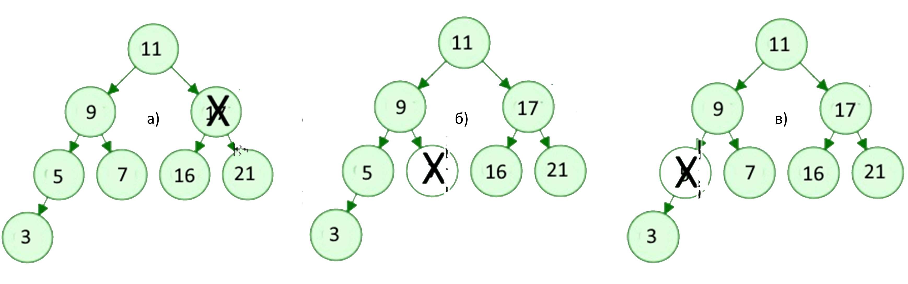
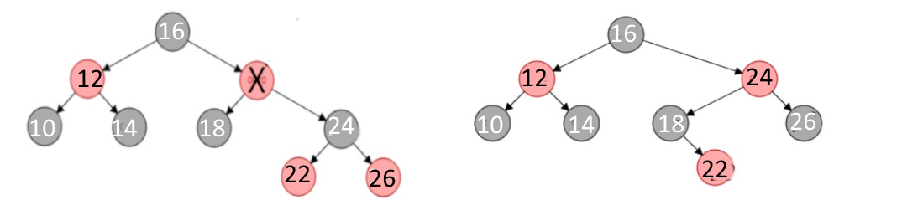

# SECTION 8. BINARY TREE ALGORITHMS

## 8.1 Representation of binary trees

The first subsection covered binary trees as an abstract data type; in this section, we will describe how these data structures are implemented computer-wise using the programming languages Golang and DRAKON, a visual algorithmic language. Remember the essential terms used to describe binary trees:

<figcaption>Figure 8.1. Basic terminology of the tree</figcaption>

*Root:* The only node in the tree without any incoming edges is the root. It is the tree's highest node;

*Node:* This is the tree's fundamental component. Each node contains two references that can point to zero or any of its offspring. The edge, which connects the two node locations, is another essential component of the tree.

*Path:* An ordered list of nodes joined by edges is called a path.

*Leaf:* A node without any descendants is called a leaf node.

*Tree height:* The number of edges on the longest path connecting a tree's root and leaf is its height.

*Node level:* The number of edges on the path leading from this node's root node is its node level.

The binary tree's information structure is set up as follows:
(Figure 8.2):

<figcaption>Figure 8.2 Binary tree structure
(*info* - value (key), (N - NULL))</figcaption>

A binary search tree is one that is arranged so that, for every node, every value in its left subtree is less than this node and every value in its right subtree is greater. Because every subtree is a tree, a BST is a recursive data structure. The following characteristics of a BSTThe nodes in the tree maintain their distinct values.

-   a binary search tree;

-   AVL-Tree;

-   Red-Black Tree.

## 8.2 Binary search tree

### 8.2.1 Building a binary tree

A binary search tree is one that is arranged so that, for every node, every value in its left subtree is less than this node and every value in its right subtree is greater. Because every subtree is a tree, a BST is a recursive data structure. The following characteristics of a BSTThe nodes in the tree maintain their distinct values.

- every node has either one, two, or zero childs;

- one of the nodes is referred to as the root node, which is at the top of the tree structure;

- each node has only one parent node, except for the root node which
has no parent node;

- the value of each node is greater than that of its left child but
less than that of its right child;

A binary search tree is built according to a certain rule (algorithm).
Consider the sequence of integers {11, 5, 17, 15, 1, 8, 19, 13, 21},
represented as a slice of numbers. First the root node {11} is
formed, then in the loop for each node recursively the method
insert(value) is called (Figure  8.3 a), which in turn calls the method createNode(value), which creates a new node (Figure  8.3 b) and places it in the left or right subtree depending on the value (Figure  8.3c).

<figcaption>a) building a tree; b creating a node</figcaption>

<figcaption>c) *insertion (value)* method</figcaption>

<figcaption>Figure 8.3. Drakon-diagram of tree building methods</figcaption>

The complete process of creating a binary tree is shown in Figure 8.4. The first number 11 is written to the root of the tree. The second number 5 is less than the value in the tree root, so it is written to the left subtree. The next number 17 is greater than the root number, so it is written to the right subtree. Then the number 15 is greater than the value at the root of the tree, so it is written to the right subtree, but the right subtree is already built. The number 15 is compared to the number 17 at the root of the right subtree. Since the value to be added is less than the value in the root of the right subtree, we add the left subtree to this node. The final result is a binary search tree with three variants: a node 5 is the parent of two children (1.8), a node 15 has only a left child, and a node 19 has only a right child. This arrangement of nodes is chosen to demonstrate the function of removing nodes, which will be discussed later.

<figcaption>Figure 8.4. Building a binary tree</figcaption>

### 8.2.3 Finding a node based on a set value

Another basic operation is the *findNode(value)* function. This function uses a Golang construct, Select, which recursively compares the value of val with the values of other nodes as it traverses the tree. Note that the Select statement is represented by if-else operators in the generated code. If a match is found, the result \"Node exists\" is printed. The absence of a node with this value is detected by the equality *\<nil\>* of the addresses *root.leftNode* and *root.rightNode* in the variable root of type BSTree: *BSTree struct {*

*rootValue int*

*leftNode \*BSTree*

*rightNode \*BSTree*

*}*

The Drakon diagram  of the *findNode(root \*BSTree, val int)* function is shown in Figure 8.5. The search is performed over the whole tree, the end nodes are determined when the condition (*root.leftNode == nil && root.rightNode == nil)* is satisfied.

<figcaption>Figure 8.5. Dragon-diagram of *findNode(root \*BSTree, val int)* method</figcaption>

### 8.2.3 Deleting a node with a set value

The next basic operation is to delete a node with the given value. The function *deleteNode (root \*BSTree, val int)* is used recursively. The algorithm of this function is complicated by the fact that the following descendant arrangements are possible, as shown in Figure 8.3:

\(a\) Node 21 to be deleted has no descendants;

b\) the node 19 to be deleted has a right-hand descendant;

c\) the node 15 to be deleted has a left-hand descendant;

d\) the node 5 to be deleted has a right-hand descendant.

Let\'s analyse in more detail the order in which the nodes are moved in these variants.

*Option a):* Node (21) has no descendants (Figure 8.6.).

In this case, this node is removed by changing the value of *root = nil* in the parent node. Figure 8.6. shows the process of deleting node (21) and the corresponding Drakon diagram  fragment, where L1 := root.leftNode == nil and R1 := root.rightNode == nil.

<figcaption>Figure 8.6. Deleting a node without childs</figcaption>

*Option b):* Node (19) has a right-hand descendant (Figure 8.7).

In this case, node (19) is removed from the tree by replacing its
address in the parent node (17) with the address of its only descendant node (21). Figure 8.7. shows the process of removing node (19) and the corresponding Drakon diagram  fragment, where *L1 := root.leftNode == nil* and *R2 := root.rightNode != nil*.

<figcaption>Figure 8.7. Deleting node (19) with right-hand descendant</figcaption>

*Variant c):* Node (15) has a left-hand child (Figure 8.8.).

In this case, node (15) is removed from the tree by replacing its
address in parent node (17) with the address of its only child node
(13). Figure 8.8. shows the process of removing node (15) and the
corresponding Drakon diagram  fragment, where L1 := root.leftNode == nil and R2 := root.rightNode != nil.

<figcaption>Figure 8.8. Deleting node (15) with left-hand child</figcaption>

*Variant d):* Node (5) has two descendants (Figure 8.9.). In this case the binary search tree is rearranged: node (2) moves to the place of node (5):

<figcaption>Figure 8.9. Deleting a node (5) with two childs</figcaption>

The algorithmic representation of the process for removing a node from a binary search tree in Drakon diagram  form is shown on Figure.8.10:

<figcaption>Figure 8.10. Drakon-diagram depicting the process of removing a node </figcaption>

### 8.2.4 Traversing the binary search tree

 One of the basic tree operations is to traverse tree nodes. Unlike
 linear data structures, where elements are traversed in a linear
 order, tree nodes can be traversed in a variety of ways. A traversal  in which each ancestor node is traversed before its childs is called a  pre-order traversal or a forward traversal. A traversal where each
 ancestor node is traversed before its ancestors is called a post-order  traversal. There is also an in-order traversal where the left subtree  is visited from bottom to top, then the root node, then the right  subtree (Figures 8.11, 8.12, 8.13)
 \[[https://intellect.icu/derevo-kak-struktury-dannykh-dvoichnye-binarnye-derevya-9856]{.mark}\].

<figcaption>Figure 8.11. a) Direct tree traversal ;b) PreOrder() Drakon diagram </figcaption>

<figcaption>Figure 8.12. a) Centred traversal; b) InOrder() Drakon-diagram</figcaption>

<figcaption>Figure 8.13. a) Reverse traversal; b) Drakon diagram  of the PostOrder() function</figcaption>

## 8.3 Self-balancing binary trees (AVL-trees)

The efficiency of any tree operation depends substantially on the order in which the input data is received. For example, if an incoming sequence of numbers is partially sorted in ascending or descending order, this structure will no longer look like a tree (Figure 8.14).

Fig8_14_ER_avl_0

<figcaption>Figure 8.14. Partially sorted input data</figcaption>

In such practically \"degenerate\" trees, the complexity of the
operations is determined by the number of nodes, i.e. it is almost
linear - Ο(n). The left and right subtrees are unbalanced, which can be estimated by the balance coefficient (kb), which is equal to the difference between the heights of the left and right subtrees. Recall that the height of a tree is defined as the length of the longest branch in a subtree (sum of edges). For an ideal binary search tree (a tree where the number of nodes in the left subtree is equal to the number of nodes in the right subtree), this factor is 0 (Figure 8.15).

<figcaption>Figure 8.15. An ideal binary tree</figcaption>

In real life, ideal binary trees are almost never achieved; programmers often try to build a tree where the height of the left subtree differs from the height of the right subtree by no more than 1. Such trees are called AVL-trees; for such trees the complexity of operations is defined as O(logn), i.e. the execution time of basic operations (search, delete) is significantly less than for BST-trees.

The algorithms for such trees are based on the process of balancing the tree when a new node is inserted or an existing node is removed. The purpose of balancing is to reconstruct the tree so that the heights of the left and right subtrees do not differ by more than 1. The balancing factor must satisfy the following conditions allowable values kb = -1, 0 and +1;

-   The value kb = -1 indicates that the right subtree \"outweighs\" the left subtree;

-   The value kb= +1 indicates that the left subtree \"outweighs\" the right subtree;

-   a value of kb = 0 indicates that the tree contains an equal number of nodes on each side, i.e. the tree is perfectly balanced.

The balancing technique boils down to making circular movements of the knots in four variants:

-   right turn (RR);

-   Left turn (LL);

-   Right - left turn (RL);

-   Left to right turn (LR).

The right-hand turn is performed when the root node has a balance factor kb = +2 and its left-hand child has a balance factor kb = +1 (Figure 8.16):

<figcaption>Figure 8.16. Right turn</figcaption> 

The left-hand turn is performed when the root node has a balanced kb = - 2 and its right-hand descendant has a balanced kb = - 1 (8.17):

<figcaption>Figure 8.17. Left turn</figcaption>

A right-left turn is performed when the root node has a balance factor kb = -2 and its right-hand child has a balance factor kb = +1 (Figure 8.18):

<figcaption>Figure 8.18. Right-left turn</figcaption>

Left-right rotation is performed when a node has a balance factor of kb = +2 and its left child has a balance factor of kb = -1 (Figure 8.19):

<figcaption>Figure 8.19. Left-right turn<figcaption>

Consider the balancing process in more detail with an example of tree formation when input data is received in this order: 21, 17, 16, 11, 9, 7, 5, 3. Such a tree is unbalanced, or almost a \"twig\" (Figure 8.20):

<figcaption>Figure 8.20. Unbalanced tree</figcaption>

Balancing checks are started on the arrival of each new node using the *InsertNode(node \*node, value int)* method, which determines the position of the new node in the left or right subtree relative to the root node. The choice of the balancing path is determined by the method *rotateInsert(node \*node, value int)*. A Drakon diagram  of the algorithms of the above methods is shown in Figure 8.21.

<figcaption>Figure 8.21. Drakon-diagram depicting the  inserting node method</figcaption>

The choice of one of the possible balancing paths (rotations) is
determined by the *rotateInsert(node \*node, val int)* method (Figure 8.22)

<figcaption>Figure 8.22. Drakon diagram  of the *rotateInsert(node \*node, val int)*method</figcaption>

Depending on the location of the new node relative to the parent node and the balance factor values, the left-hand or right-hand rotation methods are invoked (Figure 8.23):

<figcaption>Figure 8.23. Node rotation programme codes</figcaption>

Let\'s look at the tree rebuilding process in detail as a result of
using the rotateInsert(node \*node, val int) method on the example of entering the values of three nodes (21,17,16). After receiving the value of one node (16), a \"twig\" appears instead of the tree that needs to be balanced. In this case the condition in the rotateInsert(node \*node, val int) method is met: the balancing factor is 2 and the value of node (16) is less than the parent node (17) and the rightRotate(node) method is called. The balancing process is shown in Figure 8.24: 

<figcaption>Figure 8.24. Process of rotating assemblies for balancing</figcaption>

As you can see from this figure, the result of the *rightRotate(node)* method is the address fields of elements of the node structure. Recall that this structure consists of four fields: tree height, node value, and addresses of left and right descendant nodes. Figure 8.18 shows the addresses of the descendant nodes below the node value. After rearranging the structure fields node.left and node.right, nodes (17) and (21) change and node (17) becomes the root node, node (16) remains unchanged and the former root node (21) becomes the right descendant node (17). As a result of the entry of node (16) the tree becomes balanced.

The process of new nodes arriving and rebuilding the resulting tree by balancing for the input set (21,17,16,11,9,7,5,3) is shown in Figure 8.25.

<figcaption>Figure 8.25. Process of building a balanced AVL tree</figcaption>

The basic operations with AVL-trees are the *findNode(node \* node,
val)* and *removeNode(node \* node, val)* operations. Drakon diagram  of *findNode(node \* node, val)* method is shown in Figure 8.26:

<figcaption>Figure 8.26. Drakon-diagram depicting the finding a node method </figcaption>

Another basic operation, deleting a node with a given value, consists of the following steps. The node is searched from the root down through the branches to the node to be deleted. The following situations may occur (Figure 8.27):

<figcaption>Figure 8.27. Options for nodes to be removed</figcaption>

 a) The node to be deleted has two non-empty descendants;
 b) The node to be deleted has no descendants;
 c) The node to be deleted has one descendant (left or right).

As with the other methods, a node with a specified value is first
recursively identified and then one of the options presented is
selected. A Drakon diagram  of the algorithm for removing a node with the given value is shown in Figure 8.28.

<figcaption>Figure 8.28. Drakon-diagram algorithm for removing a node with a given value</figcaption>

The *main()* program inputs an array of data, searches for a node with a given value, and deletes a node with a given value. The result of implementing the generated code is shown below:

*Traversing the tree prior to removal:*

*preOrder 11 7 5 3 9 17 16 2 1*

*inOrder 3 5 7 9 11 16 17 21*

*postOrder 3 5 9 7 16 21 17 11*

*The number 3 is present*

*Number 6 is missing*

*Removing the node 7*

*Traversing the tree after deleting number 7*

*preOrder 11 5 3 9 17 16 21*

*inOrde 3 5 9 11 16 17 21*

*postOrder 3 9 5 16 21 17 11*

## 8.4 Red-black trees

### 8.4.1. Properties of red-black trees
A red-black tree is a variant of a self-balancing binary search tree in which the nodes are placed according to a certain rule and coloured red or black (Figure 8.29)

<figcaption>Figure 8.29. Red-black tree</figcaption>

The nodes containing data (in this case, integers) are internal. In
addition, red-black trees contain imaginary, \"null\" nodes associated with tree leaves (Null - in Figure 8.28). Red-black trees satisfy all the properties of a binary search tree and must have the following properties:

1. Each node is coloured red or black.

2. The root of the tree is always black.

3. All leaves are black (Null).

4. Both descendants of the red node are black, i.e. there cannot be
consecutive red nodes.

5. All simple paths from the node to the descending leaves contain the same number of black nodes.

Unlike AVL trees, where balance is achieved by balancing the heights of the left and right subtrees, red-black balance is achieved by the properties mentioned above. Adding or removing a node from the red-black tree can disrupt the red-black tree properties, and restoring balance is achieved by two operations: repainting the nodes and/or rebuilding the whole tree or its subtrees using specific rotations.The most important of these properties are properties 4 and 5.

A consequence of property 4 is that it requires the same number of red and black nodes in the path between two nodes. Property 5 requires that regardless of the choice of path between two nodes the number of black nodes must be the same. In other words, in the worst case, the height of the tree must not be more than twice the height of the shortest path. In this case the red-black tree becomes fairly balanced.

### 8.4.2. Inserting a new node and the balancing process 

To achieve a balanced red-black tree, the process of inserting a new
node is accompanied by a check to ensure that the above properties are satisfied. As red-black is a binary search tree (BST), it first
determines where on the tree the node should be placed, colouring it red (Figure 8.30):

<figcaption>Figure 8.30. Drakon-diagram  of the _insertNode(node,data)_ method</figcaption>

This method calls the *NewNode(d,nullNode)* function, which returns full information about the new node, with the colour field of type bool initially taking the value red:

Next, consider the node positions in the tree as a result of each new node insertion and determine which properties of the red-black tree are violated. To understand this process, we introduce the following notation: x - new node, P (Parent) - parent of node x, G (Grandparent) - ancestor (parent of parent), U (Uncle) - uncle of node x (Figure 8.31):

<figcaption>Figure 8.31. Depiction of associated nodes x, P, G, U </figcaption>

When a new element is inserted, it is assigned a red colour. To satisfy the first two rules, it is sufficient to simply repaint the new vertices in the desired colour. After each insertion, all the properties of the red-black tree must be checked. If at least one property is not satisfactory, the rotation and colour change operations are performed. Figure 8.32. shows all cases of mutual arrangement of related nodes and fragments of the corresponding Drakon-diagram.

<figcaption>Figure 8.32. Illustration of red-black tree balancing algorithms</figcaption>

Consider the balancing process using the example of building a red-black tree from sets of integers that are the keys of the input nodes: {11,12,13,14,15,16,17,18,19} (Figure  8.33):

<figcaption>Figure 8.33. Red-black tree balancing process</figcaption>

The first two steps do not violate any properties. Entering a node with key (13) causes property #4 to be disturbed. To restore the balance in the third step, a counterclockwise left rotation is performed, causing node (12) to become the root node, changing its colour to black, and the former root node (11) to become the left descendant. In the next step a situation arises where three nodes become red: new node x(14), parent P(13) and uncle U(11), here the balance can be achieved by changing the colour of nodes (11) and (13).

Other sets of keys produce other combinations of related nodes (x, P, G, U) of the tree, which are balanced by node rotations and colour changes, as illustrated by the dragon diagram (Figure  8.34). The red-black tree-balancing dragon diagram is shown in Figure 8.34. This diagram is created in silhouette mode and consists of four branches. In the first branch the root node is coloured black. The second branch defines the hierarchy of related nodes (x, P, G, U), the third branch colours these nodes according to the hierarchy. The fourth branch calls the appropriate rotation methods.

<figcaption>Figure 8.34. Red-black tree balancing Drakon-diagram</figcaption>

It’s important to note that the structure of a red-black tree can vary based not only on the sequence in which elements are inserted, but also on the specific implementation algorithm utilized. Despite potential changes in the tree’s structure, all red-black trees constructed from the same data set will maintain the same “black height” (the count of black nodes from the root to any leaf), a fundamental characteristic of red-black trees. This property ensures the tree’s balance, thereby optimizing the efficiency of search, insertion, and deletion operations.

<figcaption>Figure 8.35. Red and black trees built on the same array</figcaption>
<figcaption>а) [10,12,14,16,18,20,22,24,26]; b) [26,24,22,20,18,16,14,12,10]</figcaption>

## Deleting a node in a red-black tree
Removing a node from a red-and-black tree is a complex process because it depends on the location of the node, the presence of children, and the color of the nodes. It is important to remember that all transformations of the tree structure must respect its properties. The Drakon-diagram of the node removal algorithm is shown in Figure  8.36. This algorithm can be divided into three stages.
The first step is to delete the node. The algorithm traverses the nodes of the red-black tree, moving left or right, depending on whether the key of the current node is larger or smaller than the specified value. When a  node with the key key is found, it is stored  in the variable z. The specified node is then removed from its original location in the tree.
The second step is to fix the double black node. If the node to be deleted was black, it may compromise the properties of the red-black tree, since all paths from the root to the leaves must contain the same number of black nodes. To remedy this, the concept of  a "double black" node is introduced. If node x that replaced the deleted node is black, it becomes a "double black" node. 
The third stage is the correction of the double black node. To fix the "double black" node, the fixDoubleBlack function (node *Node) is called  (Figure  8.38).  This feature fixes the "double black knot" by using a series of twists and repaints. She considers several cases, depending on the color of the brother of the "double black" knot and his descendants. The fixDoubleBlack function (node *Node) handles all of these cases to ensure that the red-black wood remains balanced after each removal operation. 

<figcaption>Figure 3.36. Drakon-diagram of algorithm for removing a node from a red-black tree</figcaption>

Consider in more detail the different instances of the removal node in the structure of the red-black tree. In the first step, the node is removed simply as a node in the binary search tree. If the replacement node is a "red" node, or if the removed node is a "red" node, the removed node is replaced by another node. There is no need to make any further changes to the tree structure (Figure 8.37).  

<figcaption>Figure 3.37. Deletion of red node (20)</figcaption>

If the node to be deleted and the node that replaces it are black nodes, a situation called a "double black node" occurs. In this case, some additional operations must be performed to ensure that the properties of the red-black wood are preserved. The drakon- diagram algorithm of this process is shown in Figure  8.38.
If the replacement node is a leaf node (i.e., has no child nodes), we replace the node with a "zero" leaf node and color it black. If the replacement node has one child node, we replace the node with its child node and color it black. If the replacement node has two child nodes, we replace the node with its subsequent node in order, and then delete the next node in order (which is no more than a node with one child node) using the method described above.

<figcaption>Figure 8.38. Drakon-diagram of the node structure correction algorithm when removing "double black node"</figcaption>

If a node is deleted and replaced with another node, the properties of the red-black wood may be compromised. To restore them, the following operations must be performed:
1.	If the node to be deleted is red, the properties of the red-black tree are not disturbed. If the replacement node is red, it should be repainted black.
2. Next, rotate, recolor the nodes and/or transfer the "blackness" (the number of black nodes relative to the red ones) up the tree until the tree is balanced.
3. At the same time, you need to make sure that the root of the tree is black.
Let's consider options for restoring the properties of red-black wood. Enter the following notations: the node to be deleted is "x", the child node of the deleted node is "y", and the sibling of the node to be deleted is "s" (Figure 8.39).

<figcaption>Figure 8.39. Tree node relationship</figcaption>
        
 Option 1: If the child element (y) of the node to be deleted (x) is colored red, then after deletion it should be recolored black, as a result of which the number of black nodes will be restored (Figure 8.40).       

<figcaption>Figure 8.40. Deleting and repainting the child of the node to be removed (y)</figcaption>

Option 2: When the sib(s) of the node to be deleted (x) is colored black, and at least one of the descendants is red, then four different combinations are possible: 
• Option 2(a): The brother(s) of the node to be deleted (x) is black. In this case, the brother (s) is the left descendant of the parent (P), and the left child of the brother is colored red. This is the so-called "left-left configuration", in which the balance is achieved by the right rotation, after which the color of the child should be replaced by black (Figure 8.41).

<figcaption>Figure 8.41. Left-Left node delete configuration</figcaption>

Option 2(b): Mirror image of case 2(a). The "s" brother is his parent's right child, and his right child is the red child. The right-right configuration performs a left-hand rotation. The child node is then changed to black. As a result, the black node counter property is restored (Figure 8.42). 

<figcaption>Figure 8.42. Right-Right configuration of node deletion</figcaption>

Option 2 (c). The brother (s) of the remote node (y) is black. The brother(s) is the left offspring of his parent, and his right child is red. This is a left-to-right configuration, so a left rotation is performed followed by a right rotation. The child node is colored black (Figure 8.43).

<figcaption>Figure 8.43. Left-Right node delete configuration</figcaption>

Option 2(d): The brother (s) of the remote node (y) is colored black. The brother (s) is the right child of his parent (P) and his left child is the red child. A right-left rotation is then performed, followed by a left-hand rotation. The color of the child node changes to black (Figure 8.44). 

<figcaption>Figure 8.44. Right-Left node delete configuration</figcaption>

Option H: If the node (y) to be removed and its brother(s) are colored black and both of its descendants are missing, i.e. black by definition, then you need to recolor the children red and recursively add black to the parent. If the parent was red, then it became black. If the parent was black, it would become double black. If the parent is the root, then it remains black. For example, below is a case where the node (y) to be deleted and its brother (s) are black (Figure 8.45).

<figcaption>Figure 8.45. The process of rebuilding a tree with two black nodes (y) and (s)</figcaption>

Option 4: If the sib(s) of the node to be removed (y) is colored red, then a rotation is performed to achieve the balance of the tree. The sister nodes are then repainted. For example, consider the following option (Figure 8.46).

<figcaption>Figure 8.46. The process of rebuilding a tree with two black nodes (y) and (s)</figcaption>

